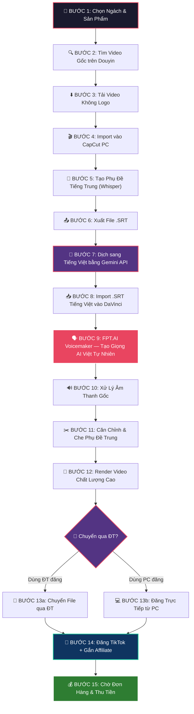
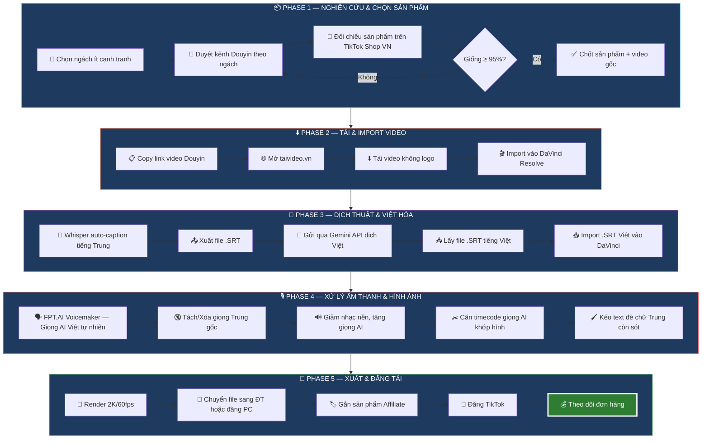
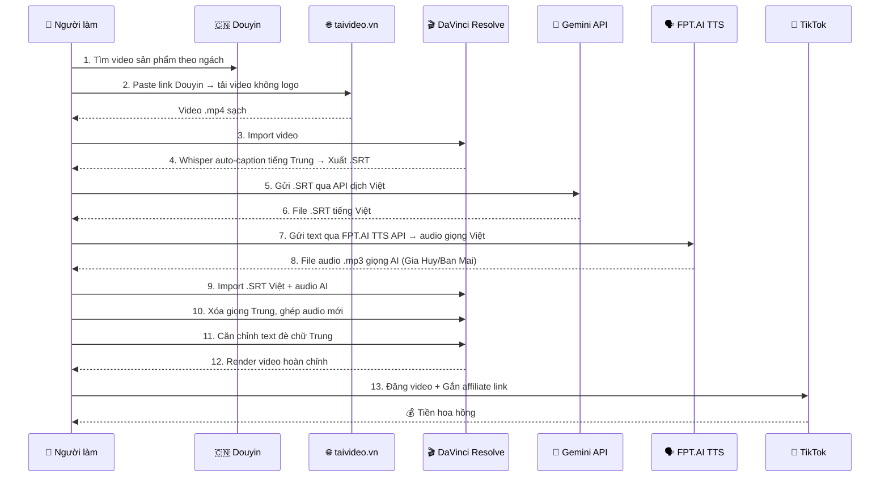
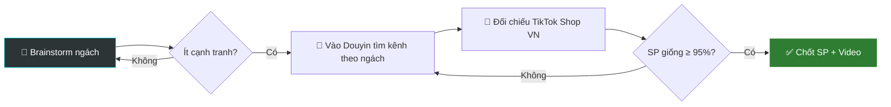
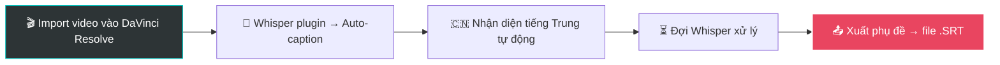
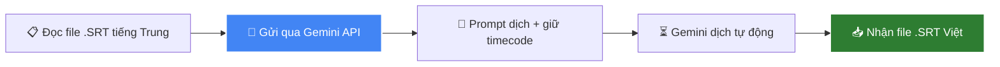
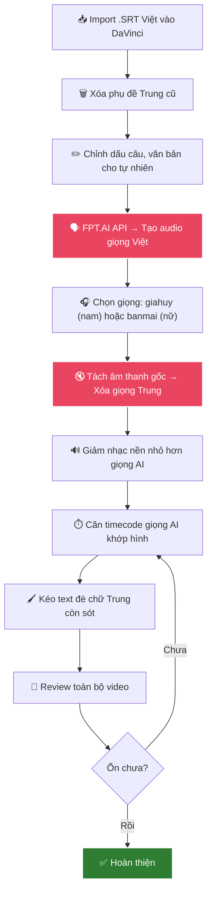
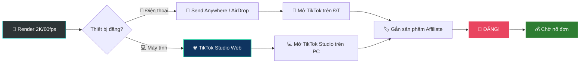
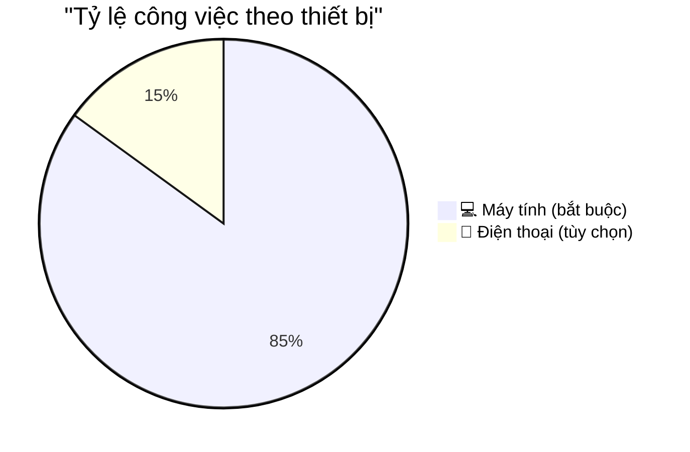

# 🔥 Workflow: TikTok Shop Affiliate — Re-up Video Douyin

> Mở file này bằng **Markdown Preview** (Ctrl+Shift+V) để xem sơ đồ trực quan!
> 
> 📅 Bóc tách từ video hướng dẫn thực chiến — 09/04/2026

---

## 📊 Sơ đồ tổng quan — Toàn bộ quy trình

---

## 🔄 Workflow theo Phase — Nhìn chia nhóm

---

## 🛠️ Hệ sinh thái công cụ — Sequence Diagram

---

## 📋 Chi tiết từng bước

### Bước 1: 🎯 Chọn Ngách & Sản Phẩm

**Tiêu chí quan trọng:**
- Ngách ít cạnh tranh (ví dụ: gia dụng, đồ tiện ích)
- Video gốc chất lượng cao, mới đăng
- Sản phẩm trên TikTok Shop VN phải giống **tối thiểu 95%** với video Douyin
- Đánh vào **chất lượng**, không đánh vào số lượng

---

### Bước 2–3: ⬇️ Tải Video Douyin

**Công cụ:** `taivideo.vn` hoặc Google tìm "tải video Douyin" — chọn tool miễn phí, tải sạch logo.

---

### Bước 4–6: 📝 Tạo Phụ Đề & Xuất SRT

**Công cụ:** DaVinci Resolve (MIỄN PHÍ) + plugin Whisper để auto-caption. Hoặc dùng **SubtitleWhisper.com** (online, miễn phí) nếu chưa cài plugin.

---

### Bước 7: 💎 Dịch bằng Gemini API

**Prompt mẫu:**
> *"Đây là hội thoại review sản phẩm [TÊN SP]. Hãy dịch từ tiếng Trung sang tiếng Việt, sửa theo chuẩn văn phong Việt Nam, càng hài hước càng tốt. Giữ nguyên timecode. Sau đó xuất thành file .SRT."*

**Tại sao Gemini API:**
- ✅ Sếp đã có API key sẵn
- ✅ Không giới hạn như ChatGPT free (bị rate limit, phải chờ)
- ✅ Có thể tự động hóa bằng script (không cần copy-paste thủ công)
- ✅ Dịch chất lượng tương đương hoặc tốt hơn ChatGPT free

---

### Bước 8–11: 🎙️ Xử Lý Âm Thanh & Hoàn Thiện

**Về FPT.AI Voicemaker (MIỄN PHÍ 100K ký tự/tháng, giọng cực hay):**
- 🎙️ **giahuy** — Giọng nam miền Nam, trẻ, năng động (⭐ khuyên dùng cho review/game)
- 🎙️ **banmai** — Giọng nữ miền Bắc, tự nhiên, truyền cảm (phổ biến nhất)
- 🎙️ **leminh** — Giọng nam miền Bắc, trầm, chuyên nghiệp
- API: `POST https://api.fpt.ai/hmi/tts/v5` — Lấy key từ https://console.fpt.ai
- Free tier: **100.000 ký tự/tháng** (~2.3 giờ audio — đủ làm ~70 video TikTok)
- 📌 **Xem chi tiết script & API →** File `workflow-tiktok-chi-tiet.md`

**Mẹo chỉnh sửa:**
- Nhạc nền Douyin thường **to quá** → phải giảm xuống thấp hơn giọng thuyết minh
- Bọn Trung nói nhanh → tiếng Việt sẽ thừa hoặc thiếu → tăng tốc độ đọc hoặc cắt câu thừa
- Chỉnh từng đoạn phụ đề riêng cho chuẩn, không "áp dụng cho tất cả"

---

### Bước 12–15: 🚀 Xuất & Đăng Tải

---

## 📱 vs 💻 — CÓ CẦN ĐIỆN THOẠI KHÔNG?

### Kết luận: ❌ KHÔNG BẮT BUỘC — Máy tính làm hết 100% được!

### So sánh chi tiết:

| Công đoạn | 💻 Máy tính | 📱 Điện thoại | Ghi chú |
|-----------|:-----------:|:-------------:|---------|
| Tìm ngách/SP trên Douyin | ✅ Web | ✅ App | PC tiện hơn để so sánh |
| Tải video Douyin | ✅ taivideo.vn | ✅ App tải | PC nhanh hơn |
| Chỉnh sửa video | ✅ **DaVinci Resolve** | ❌ Chỉ PC | **PC bắt buộc** — phần mềm chuyên nghiệp |
| Dịch Gemini API | ✅ Script tự động | ✅ API | Tự động hóa được |
| Render video | ✅ Nhanh hơn | ⚠️ Chậm hơn | PC vượt trội |
| **Đăng TikTok** | ✅ **TikTok Studio** | ✅ App TikTok | **Cả hai đều được!** |
| Gắn Affiliate | ✅ TikTok Studio | ✅ App TikTok | **Cả hai đều được!** |

### 🔑 Giải pháp 100% máy tính — không cần điện thoại:

**TikTok Studio** (https://www.tiktok.com/tiktokstudio) cho phép:
- ✅ Upload video trực tiếp từ PC
- ✅ Thêm mô tả, hashtag
- ✅ Gắn sản phẩm Affiliate
- ✅ Lên lịch đăng bài
- ✅ Xem analytics & đơn hàng

> 💡 **Lý do video gốc dùng điện thoại:** Người hướng dẫn thói quen dùng app TikTok trên ĐT + dùng Send Anywhere chuyển file. Nhưng đây là **thói quen cá nhân**, không phải yêu cầu bắt buộc. TikTok Studio trên web làm được tất cả.

---

## 💰 Chi phí vận hành

| Mục | Chi phí | Ghi chú |
|-----|---------|---------|
| DaVinci Resolve | **MIỄN PHÍ** | Thay CapCut Pro, chuyên nghiệp hơn |
| Gemini API | **MIỄN PHÍ** (free tier) | Thay ChatGPT, không giới hạn |
| FPT.AI Voicemaker | **MIỄN PHÍ** (100K ký tự/tháng) | Giọng Gia Huy/Ban Mai — tự nhiên nhất |
| Whisper (auto-caption) | **MIỄN PHÍ** | Plugin DaVinci hoặc online |
| taivideo.vn | **MIỄN PHÍ** | Tải video Douyin |
| Send Anywhere | **MIỄN PHÍ** | Chỉ cần nếu dùng ĐT đăng |
| TikTok Studio | **MIỄN PHÍ** | Đăng bài từ PC |
| **TỔNG** | **🎉 0đ/tháng** | **Hoàn toàn MIỄN PHÍ!** |

---

## 💡 Mẹo & Lưu ý quan trọng

1. **Chất lượng > Số lượng** — 1 video chuẩn hơn 10 video bừa
2. **Sản phẩm phải giống 95%+** — Người mua thông minh, không bịp được
3. **Prompt Gemini càng chi tiết càng tốt** — Nêu rõ tên SP, phong cách dịch
4. **Nhạc nền phải NHỎ hơn giọng thuyết minh** — Douyin hay cho nhạc to
5. **Chỉnh từng đoạn phụ đề** — Không dùng "áp dụng cho tất cả"
6. **Chọn giọng AI phù hợp ngách** — Gia dụng → giọng nữ vui vẻ
7. **Render chất lượng cao** — 2K/60fps tối thiểu
8. **Kênh tham khảo:** `@shopdogiadunghuuich` (kênh của người hướng dẫn)

---

> 📌 **Ctrl+Shift+V** để xem sơ đồ trực quan!
