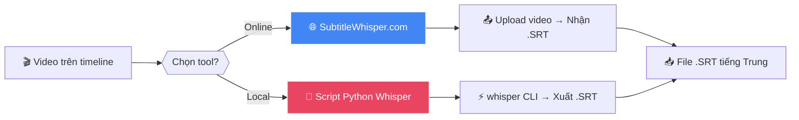
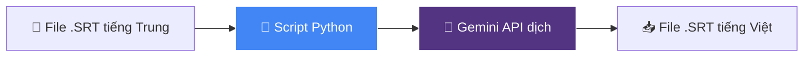
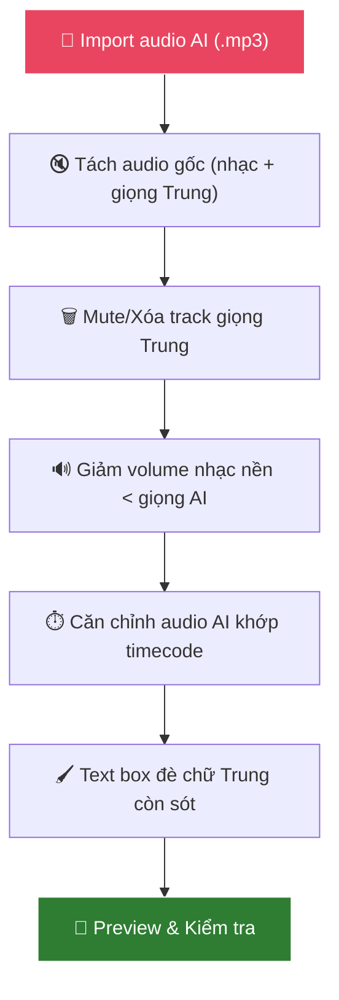
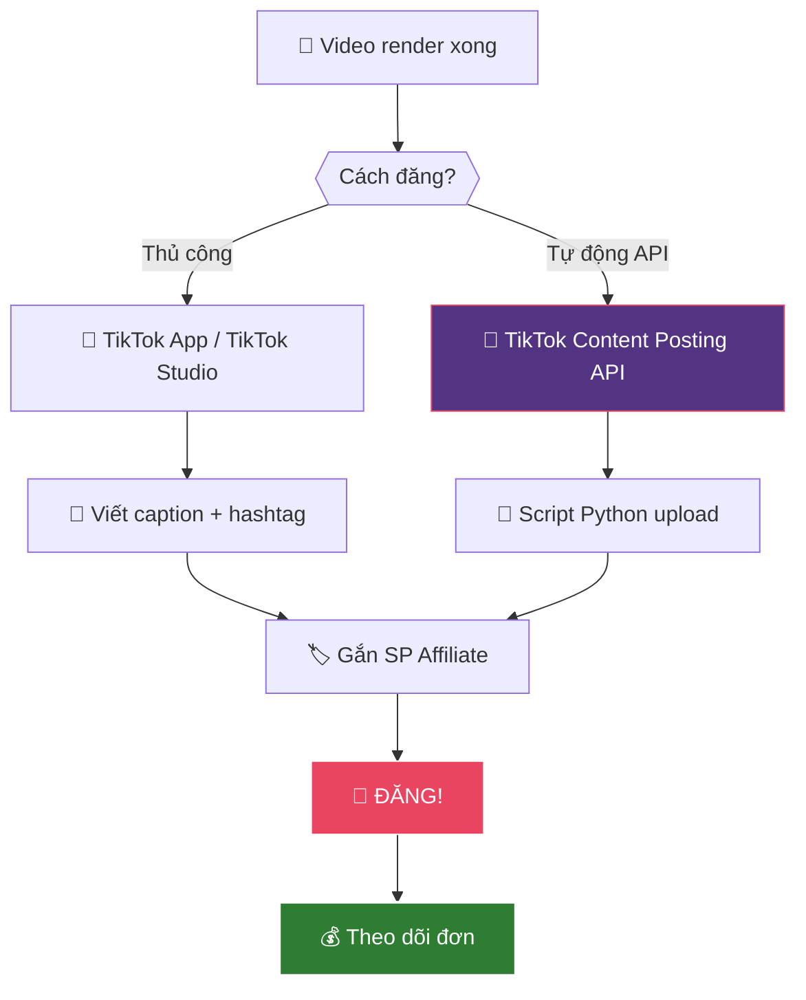
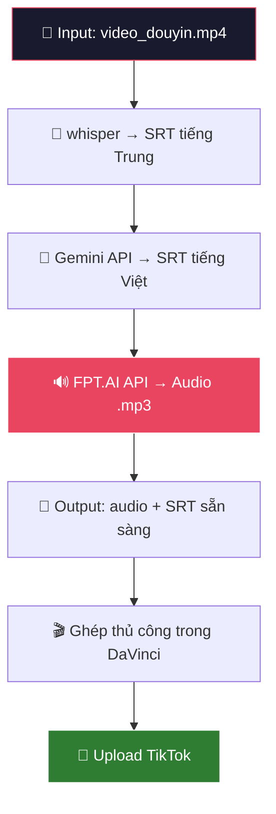

# 🔥 Workflow Chi Tiết: TikTok Shop Affiliate — Re-up Video Douyin

> **Bản này bổ sung CHI TIẾT** cho từng bước: phần mềm gì, API nào, link ở đâu, script ra sao.
> 
> 📅 Cập nhật: 10/04/2026 | 📌 Xem kèm: `workflow-tiktok-affiliate-reup.md`

---

## 📦 PHASE 1 — NGHIÊN CỨU & CHỌN SẢN PHẨM

### Bước 1.1: Tìm sản phẩm hot bằng công cụ data


#### 🛠️ Công cụ & Cách làm:

| Bước | Phần mềm/Công cụ | Link | Chi phí | Cách dùng |
|------|-------------------|------|---------|-----------|
| Tìm SP hot | **Kalodata** | https://kalodata.com | Free tier có | Vào tab "Products" → Lọc theo Category + Country: Vietnam → Sort theo GMV/Đơn hàng |
| Tìm SP hot (backup) | **FastMoss** | https://www.fastmoss.com/vi | Free tier có | Tab "Sản phẩm" → Lọc theo "Bán chạy nhất" + Ngành hàng |
| Spy đối thủ | **Kalodata** | Tab "Creators" | Free | Xem các kênh affiliate đang bán gì, video nào nhiều đơn |
| Duyệt Douyin | **Douyin Web** | https://www.douyin.com | Free | Tìm theo keyword tiếng Trung (dùng Google Translate) |
| Duyệt Douyin (app) | **Douyin App** | App Store/CH Play | Free | Cài app, search theo ngách. Video nào nhiều view = SP hot |

#### 📝 Chi tiết cách dùng Kalodata:
1. Vào https://kalodata.com → Đăng ký free
2. Tab **"Products"** → Filter:
   - Country: **Vietnam**
   - Category: Chọn ngách (Gia dụng, Làm đẹp, Thời trang...)
   - Time: **7 ngày gần nhất**
   - Sort by: **GMV** (doanh thu cao nhất)
3. Click vào SP → Xem **top video nào đang bán nhiều đơn**
4. Copy tên SP tiếng Trung → Search trên Douyin lấy video gốc

---

### Bước 1.2: Lấy link Affiliate trên TikTok Shop


#### 🛠️ Cách lấy link Affiliate:

**Cách 1 — Trên App TikTok:**
1. Mở **TikTok App** → Tab **Shop** (giỏ hàng)
2. Tìm sản phẩm cần gắn
3. Nhấn vào SP → Cuộn xuống → Nhấn **"Tiếp thị liên kết"** hoặc **"Affiliate"**
4. Nhấn **"Tạo link"** → Copy link affiliate
5. Khi đăng video → chọn **"Thêm liên kết"** → Paste link vào

**Cách 2 — Trên TikTok Seller Center (PC):**
1. Vào https://seller-vn.tiktok.com
2. Tab **"Tiếp thị liên kết"** → **"Kế hoạch mở"**
3. Duyệt SP có chương trình AFL → Lấy link
4. Hoặc: Tab **"Showcase"** → Thêm SP từ marketplace

**Cách 3 — TikTok Shop Affiliate Creator (PC):**
1. Vào https://affiliate.tiktok.com
2. Đăng nhập tài khoản TikTok
3. Tab **"Marketplace"** → Tìm SP → **"Add to Showcase"**
4. Copy link AFL từ Showcase

> ⚠️ **Yêu cầu:** Tài khoản TikTok phải đủ điều kiện làm Affiliate (≥1000 followers hoặc đăng ký Creator)

---

## ⬇️ PHASE 2 — TẢI & IMPORT VIDEO

### Bước 2.1: Tải video Douyin không logo

| Bước | Công cụ | Link | Cách dùng |
|------|---------|------|-----------|
| Copy link | **Douyin App/Web** | https://www.douyin.com | Nhấn "Chia sẻ" → Copy link |
| Tải video | **taivideo.vn** | https://taivideo.vn | Paste link → Nhấn "Tải" → Chọn "Không logo" |
| Tải (backup 1) | **SnapTik** | https://snaptik.app | Paste link → Download |
| Tải (backup 2) | **SaveFrom** | https://savefrom.net | Paste link → Download MP4 |

### Bước 2.2: Import vào DaVinci Resolve

1. Mở **DaVinci Resolve** (https://www.blackmagicdesign.com/products/davinciresolve — FREE)
2. **File → New Project**
3. Tab **Media** → Kéo thả file `.mp4` vào Media Pool
4. Kéo video xuống **Timeline**
5. Chuyển sang tab **Edit** để bắt đầu chỉnh sửa

---

## 💎 PHASE 3 — DỊCH THUẬT & VIỆT HÓA

### Bước 3.1: Tạo phụ đề tiếng Trung bằng Whisper



#### 🛠️ Cách 1 — Online (dễ nhất):
1. Vào https://subtitlewhisper.com (FREE)
2. Upload file video `.mp4`
3. Chọn ngôn ngữ: **Chinese**
4. Nhấn Generate → Đợi xử lý
5. Download file `.SRT`

#### 🛠️ Cách 2 — Script Python (nhanh hơn, offline):
```bash
# Cài đặt (1 lần duy nhất)
pip install openai-whisper

# Chạy tạo phụ đề
whisper video_douyin.mp4 --language zh --output_format srt
```
→ Kết quả: File `video_douyin.srt` chứa phụ đề tiếng Trung + timecode

---

### Bước 3.2: Dịch phụ đề sang tiếng Việt bằng Gemini API



#### 🛠️ API & Script:

**Gemini API Info:**
- Endpoint: Google Generative AI SDK
- Cài đặt: `pip install google-generativeai`
- API Key: Sếp đã có sẵn

**Script Python tự động dịch SRT:**
```python
import google.generativeai as genai

# Cấu hình API key
genai.configure(api_key="YOUR_GEMINI_API_KEY")
model = genai.GenerativeModel("gemini-2.0-flash")

# Đọc file SRT tiếng Trung
with open("video_douyin.srt", "r", encoding="utf-8") as f:
    srt_content = f.read()

# Prompt dịch
prompt = f"""Dịch file phụ đề SRT sau từ tiếng Trung sang tiếng Việt.
Yêu cầu:
- GIỮ NGUYÊN format SRT (số thứ tự, timecode)
- Dịch tự nhiên, văn phong review sản phẩm Việt Nam
- Có thể thêm chút hài hước cho cuốn hút
- KHÔNG dịch tên riêng, thương hiệu

Nội dung SRT:
{srt_content}
"""

response = model.generate_content(prompt)

# Lưu file SRT tiếng Việt
with open("video_viet.srt", "w", encoding="utf-8") as f:
    f.write(response.text)

print("✅ Dịch xong! File: video_viet.srt")
```

**Chạy:**
```bash
python dich_srt.py
```

---

## 🎙️ PHASE 4 — TẠO GIỌNG ĐỌC & XỬ LÝ ÂM THANH

### Bước 4.1: Tạo giọng đọc AI bằng FPT.AI Voicemaker


#### 🛠️ FPT.AI TTS API — Chi tiết:

| Thông tin | Giá trị |
|-----------|---------|
| **API URL** | `https://api.fpt.ai/hmi/tts/v5` |
| **Method** | `POST` |
| **API Key** | Lấy từ https://console.fpt.ai (đăng ký free) |
| **Free tier** | **100.000 ký tự/tháng** (~139 phút = ~2.3 giờ) |
| **Giọng khuyên dùng** | `giahuy` (nam, miền Nam) hoặc `leminh` (nam, Bắc) hoặc `banmai` (nữ, Bắc) |
| **Giới hạn/request** | 5.000 ký tự/lần |
| **Output** | `.mp3` hoặc `.wav` |

#### Danh sách giọng FPT.AI:

| Voice ID | Giới tính | Vùng miền | Ghi chú |
|----------|:---------:|:---------:|---------|
| `banmai` | Nữ | Bắc | ⭐ Phổ biến nhất (giọng chị Google cải tiến) |
| `leminh` | Nam | Bắc | Trầm, chuyên nghiệp |
| `thuminh` | Nữ | Bắc | Nhẹ nhàng |
| `giahuy` | Nam | Nam | 🎮 **Phù hợp thuyết minh game/review** |
| `linhsan` | Nữ | Nam | Dịu dàng |
| `myan` | Nữ | Trung | |
| `lannhi` | Nữ | Nam | |

#### 📝 Script Python gọi FPT.AI TTS API:

```python
import requests
import time
import re

FPT_API_KEY = "YOUR_FPT_API_KEY"  # Lấy từ console.fpt.ai
VOICE = "giahuy"  # Đổi thành giọng mong muốn
SPEED = "0"  # -3 (chậm) đến +3 (nhanh)

def text_to_speech(text, output_file):
    """Gọi FPT.AI TTS API để tạo audio"""
    url = "https://api.fpt.ai/hmi/tts/v5"
    headers = {
        "api_key": FPT_API_KEY,
        "voice": VOICE,
        "speed": SPEED,
        "format": "mp3"
    }
    
    response = requests.post(url, headers=headers, data=text.encode("utf-8"))
    result = response.json()
    
    if result.get("error") == 0:
        audio_url = result["async"]
        print(f"⏳ Đang xử lý audio... (~5-30 giây)")
        time.sleep(10)  # Đợi FPT xử lý
        
        # Tải file audio
        audio = requests.get(audio_url)
        with open(output_file, "wb") as f:
            f.write(audio.content)
        print(f"✅ Lưu audio: {output_file}")
    else:
        print(f"❌ Lỗi: {result.get('message')}")

def srt_to_audio(srt_file, output_dir="audio_output"):
    """Đọc file SRT và tạo audio cho từng đoạn"""
    import os
    os.makedirs(output_dir, exist_ok=True)
    
    with open(srt_file, "r", encoding="utf-8") as f:
        content = f.read()
    
    # Parse SRT
    blocks = content.strip().split("\n\n")
    for block in blocks:
        lines = block.strip().split("\n")
        if len(lines) >= 3:
            index = lines[0]
            timecode = lines[1]
            text = " ".join(lines[2:])
            
            output_file = f"{output_dir}/audio_{index.zfill(3)}.mp3"
            print(f"🗣️ [{index}] {text}")
            text_to_speech(text, output_file)
            time.sleep(2)  # Tránh rate limit

# CHẠY:
srt_to_audio("video_viet.srt")
```

**Hoặc tạo 1 file audio duy nhất từ toàn bộ text:**
```python
# Đọc SRT → gom text → gửi 1 lần
with open("video_viet.srt", "r", encoding="utf-8") as f:
    content = f.read()

# Lấy chỉ phần text (bỏ timecode)
lines = content.split("\n")
text_only = []
for line in lines:
    if not line.strip().isdigit() and "-->" not in line and line.strip():
        text_only.append(line.strip())

full_text = ". ".join(text_only)
text_to_speech(full_text, "voiceover_full.mp3")
```

#### 🔑 Cách lấy API Key FPT.AI (1 lần duy nhất):
1. Vào https://console.fpt.ai
2. Đăng ký tài khoản (Google/Facebook)
3. Menu bên trái → **Speech** → **Text to Speech**
4. Nhấn **"ENABLE"** → Copy **API Key**
5. Free: **100.000 ký tự/tháng**

---

### Bước 4.2: Xử lý âm thanh trong DaVinci Resolve



#### Thao tác trong DaVinci Resolve:
1. **Import audio AI:** File → Import Media → chọn các file `.mp3` vừa tạo
2. **Tách audio gốc:** Click chuột phải vào clip → **"Link Clips" → Uncheck** để tách audio khỏi video
3. **Xóa giọng Trung:** Highlight audio track gốc → Delete (hoặc dùng **Fairlight tab** → **Vocal Remover**)
4. **Đặt audio AI:** Kéo file `.mp3` vào track Audio mới → kéo khớp với timecode phụ đề
5. **Giảm nhạc nền:** Double-click audio track nền → giảm volume xuống **-12dB đến -18dB**
6. **Che chữ Trung:** Tab **Edit** → Effects → **Text+** → Kéo text box che phủ chữ Trung → Đổi nền match màu video

---

## 🚀 PHASE 5 — XUẤT & ĐĂNG TẢI

### Bước 5.1: Render video chất lượng cao

**Cài đặt Render trong DaVinci Resolve:**
1. Tab **Deliver** (icon tên lửa bên phải)
2. Chọn preset: **Custom**
3. Cài đặt:
   - Format: **MP4**
   - Codec: **H.264**
   - Resolution: **1080x1920** (vertical/TikTok) hoặc **2560x1440** (2K)
   - Frame Rate: **30fps** hoặc **60fps**
   - Quality: **Restrict to 20 Mbps** (hoặc Best Quality)
4. Nhấn **"Add to Render Queue"** → **"Start Render"**

---

### Bước 5.2: Đăng TikTok + Gắn Affiliate



#### Cách 1 — Đăng thủ công (khuyên dùng ban đầu):

**Trên PC - TikTok Studio:**
1. Vào https://www.tiktok.com/tiktokstudio
2. Nhấn **"Upload"** → Chọn video
3. Viết **Caption** + **Hashtag** liên quan
4. Nhấn **"Products"** → Tìm SP trong Showcase → Gắn vào video
5. Nhấn **"Post"** hoặc **"Schedule"** (lên lịch đăng)

**Trên ĐT - App TikTok:**
1. Mở TikTok → Nhấn **"+"** → Upload video
2. Viết caption + hashtag
3. Nhấn **"Thêm liên kết"** → Chọn SP Affiliate
4. Đăng!

#### Cách 2 — Tự động bằng API (nâng cao):

**TikTok Content Posting API:**

| Thông tin | Giá trị |
|-----------|---------|
| **Docs** | https://developers.tiktok.com/doc/content-posting-api-get-started |
| **Yêu cầu** | Đăng ký TikTok Developer App |
| **Quy trình** | OAuth2 → Upload video → Publish |
| **Hạn chế** | Cần được TikTok duyệt app, không gắn được Affiliate qua API |

> ⚠️ **Lưu ý quan trọng:** TikTok API hiện tại **KHÔNG hỗ trợ gắn sản phẩm Affiliate** qua API. Việc gắn SP phải làm **thủ công** trên TikTok Studio/App. Tuy nhiên, API hỗ trợ **upload video + caption tự động**.

**Script cơ bản (upload video qua API):**
```python
# Yêu cầu: Đăng ký TikTok Developer tại developers.tiktok.com
# Bước 1: Lấy access_token qua OAuth2
# Bước 2: Upload video

import requests

ACCESS_TOKEN = "YOUR_TIKTOK_ACCESS_TOKEN"

# Bước 1: Khởi tạo upload
init_url = "https://open.tiktokapis.com/v2/post/publish/video/init/"
headers = {
    "Authorization": f"Bearer {ACCESS_TOKEN}",
    "Content-Type": "application/json"
}
data = {
    "post_info": {
        "title": "Review sản phẩm siêu hot! #review #trending #tiktokmademebuyit",
        "privacy_level": "PUBLIC_TO_EVERYONE",
        "disable_comment": False,
        "disable_duet": False,
        "disable_stitch": False
    },
    "source_info": {
        "source": "FILE_UPLOAD",
        "video_size": 50000000  # bytes
    }
}

response = requests.post(init_url, headers=headers, json=data)
upload_url = response.json()["data"]["upload_url"]

# Bước 2: Upload file video
with open("video_final.mp4", "rb") as f:
    requests.put(upload_url, data=f.read(), 
                 headers={"Content-Type": "video/mp4"})

print("✅ Video uploaded! Vào TikTok Studio gắn Affiliate thủ công.")
```

> 💡 **Giải pháp thực tế:** Upload video tự động bằng API → Sau đó vào TikTok Studio gắn link Affiliate thủ công. Tiết kiệm 80% công sức.

---

## 🤖 PIPELINE TỰ ĐỘNG HÓA HOÀN CHỈNH

### Script tổng hợp: Từ SRT → Audio → Ready to upload



```python
"""
PIPELINE TỰ ĐỘNG: Video Douyin → Audio tiếng Việt
Chạy: python pipeline.py video_douyin.mp4
"""
import subprocess
import google.generativeai as genai
import requests
import time
import sys
import os

# ====== CẤU HÌNH ======
GEMINI_API_KEY = "YOUR_GEMINI_API_KEY"
FPT_API_KEY = "YOUR_FPT_API_KEY"
FPT_VOICE = "giahuy"  # banmai, leminh, giahuy, linhsan...
# ========================

def step1_whisper(video_file):
    """Bước 1: Whisper tạo SRT tiếng Trung"""
    print("🎙️ [1/3] Whisper đang tạo phụ đề tiếng Trung...")
    subprocess.run([
        "whisper", video_file, 
        "--language", "zh", 
        "--output_format", "srt"
    ], check=True)
    srt_file = video_file.rsplit(".", 1)[0] + ".srt"
    print(f"✅ Xong: {srt_file}")
    return srt_file

def step2_translate(srt_file):
    """Bước 2: Gemini API dịch sang tiếng Việt"""
    print("💎 [2/3] Gemini đang dịch sang tiếng Việt...")
    genai.configure(api_key=GEMINI_API_KEY)
    model = genai.GenerativeModel("gemini-2.0-flash")
    
    with open(srt_file, "r", encoding="utf-8") as f:
        srt_content = f.read()
    
    prompt = f"""Dịch file phụ đề SRT sau từ tiếng Trung sang tiếng Việt.
Yêu cầu:
- GIỮ NGUYÊN định dạng SRT (số thứ tự + timecode + text)
- Dịch tự nhiên, phong cách review sản phẩm Việt Nam
- Hài hước, cuốn hút
- KHÔNG thêm giải thích, CHỈ trả về nội dung SRT

{srt_content}"""
    
    response = model.generate_content(prompt)
    
    viet_srt = srt_file.replace(".srt", "_viet.srt")
    with open(viet_srt, "w", encoding="utf-8") as f:
        f.write(response.text)
    print(f"✅ Xong: {viet_srt}")
    return viet_srt

def step3_fpt_tts(srt_file):
    """Bước 3: FPT.AI TTS tạo audio tiếng Việt"""
    print("🔊 [3/3] FPT.AI đang tạo giọng đọc...")
    
    with open(srt_file, "r", encoding="utf-8") as f:
        content = f.read()
    
    # Gom text từ SRT
    lines = content.split("\n")
    text_parts = []
    for line in lines:
        line = line.strip()
        if not line.isdigit() and "-->" not in line and line:
            text_parts.append(line)
    
    full_text = ". ".join(text_parts)
    
    # Gọi FPT.AI API
    url = "https://api.fpt.ai/hmi/tts/v5"
    headers = {
        "api_key": FPT_API_KEY,
        "voice": FPT_VOICE,
        "speed": "0",
        "format": "mp3"
    }
    
    # Chia text nếu > 5000 ký tự
    chunks = [full_text[i:i+4500] for i in range(0, len(full_text), 4500)]
    audio_files = []
    
    for idx, chunk in enumerate(chunks):
        response = requests.post(url, headers=headers, data=chunk.encode("utf-8"))
        result = response.json()
        
        if result.get("error") == 0:
            audio_url = result["async"]
            print(f"  ⏳ Chunk {idx+1}/{len(chunks)} đang xử lý...")
            time.sleep(15)  # Đợi FPT xử lý
            
            audio = requests.get(audio_url)
            output = f"voiceover_part_{idx+1}.mp3"
            with open(output, "wb") as f:
                f.write(audio.content)
            audio_files.append(output)
            print(f"  ✅ {output}")
        else:
            print(f"  ❌ Lỗi: {result.get('message')}")
    
    print(f"\n🎉 HOÀN TẤT! Tạo được {len(audio_files)} file audio.")
    return audio_files

# ====== CHẠY PIPELINE ======
if __name__ == "__main__":
    video = sys.argv[1] if len(sys.argv) > 1 else "video_douyin.mp4"
    
    print("="*50)
    print("🚀 PIPELINE TỰ ĐỘNG: Video → Audio tiếng Việt")
    print("="*50)
    
    srt_zh = step1_whisper(video)
    srt_vi = step2_translate(srt_zh)
    audios = step3_fpt_tts(srt_vi)
    
    print("\n" + "="*50)
    print("📋 KẾT QUẢ:")
    print(f"  📄 SRT tiếng Trung: {srt_zh}")
    print(f"  📄 SRT tiếng Việt: {srt_vi}")
    for a in audios:
        print(f"  🔊 Audio: {a}")
    print("="*50)
    print("👉 Bước tiếp theo: Import vào DaVinci Resolve để ghép!")
```

---

## 💰 Tổng chi phí vận hành (cập nhật)

| Mục | Công cụ | Chi phí | Ghi chú |
|-----|---------|:-------:|---------|
| Nghiên cứu SP | Kalodata / FastMoss | **0đ** | Free tier đủ dùng |
| Tải video | taivideo.vn | **0đ** | Miễn phí |
| Phụ đề tiếng Trung | Whisper (local/online) | **0đ** | Open-source |
| Dịch phụ đề | Gemini API | **0đ** | Free tier (Sếp có key) |
| **Giọng đọc AI** | **FPT.AI Voicemaker** | **0đ** | **100K ký tự/tháng FREE** (~2.3 giờ) |
| Chỉnh sửa video | DaVinci Resolve | **0đ** | Phiên bản miễn phí |
| Đăng TikTok | TikTok Studio / App | **0đ** | Miễn phí |
| Upload tự động (tùy chọn) | TikTok API | **0đ** | Free, nhưng cần Developer App |
| **TỔNG** | | **🎉 0đ/tháng** | **Hoàn toàn MIỄN PHÍ!** |

---

## 📑 Tổng hợp API Keys cần chuẩn bị

| API | Nơi lấy Key | Link |
|-----|-------------|------|
| **Gemini API** | Google AI Studio | https://aistudio.google.com/apikey |
| **FPT.AI TTS** | FPT Console | https://console.fpt.ai |
| **TikTok API** (tùy chọn) | TikTok Developer | https://developers.tiktok.com |

---

## 🗺️ Checklist trước khi bắt đầu

- [ ] Đăng ký Kalodata (free) — nghiên cứu SP
- [ ] Cài DaVinci Resolve — chỉnh sửa video
- [ ] Cài Python + pip — chạy script tự động
- [ ] Lấy API Key Gemini — dịch phụ đề
- [ ] Lấy API Key FPT.AI — tạo giọng đọc
- [ ] Đăng ký TikTok Affiliate — gắn link SP
- [ ] Cài Whisper (`pip install openai-whisper`) — tạo phụ đề
- [ ] Test thử 1 video mẫu — chạy toàn bộ pipeline

---

> 📌 **Ctrl+Shift+V** để xem sơ đồ trực quan!
